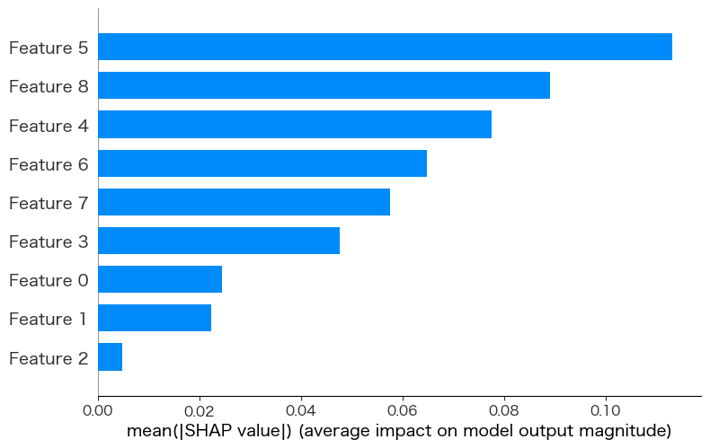
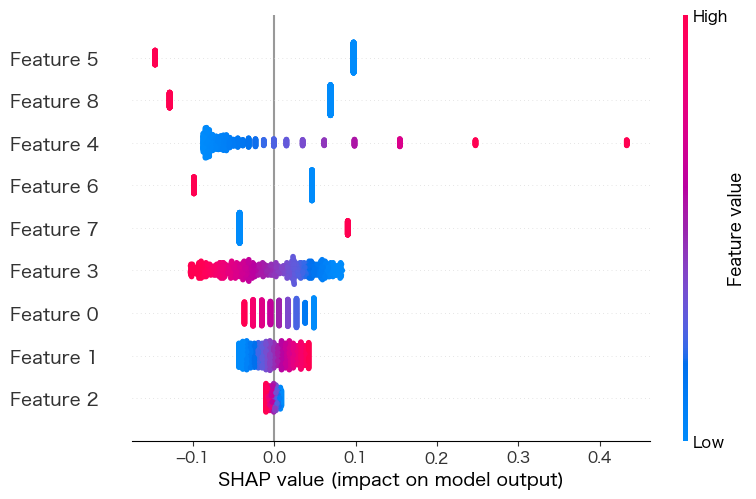

# 営業データ分析ポートフォリオ

このリポジトリでは、営業データを活用した詳細なデータ分析を行い、受注・失注のパターンを明らかにする機械学習モデルを構築しています。

## 📌 プロジェクト概要

本プロジェクトでは、以下のステップで営業データを分析し、ビジネスインサイトを得ることを目的としています。

1. **データの前処理**
   - 欠損値の処理
   - 異常値の検出・補正
   - 特徴量エンジニアリング

2. **データの可視化**
   - 受注/失注の傾向分析
   - 成約率に影響を与える要因の可視化
   - 営業担当者別のパフォーマンス分析

3. **機械学習モデルの構築**
   - ロジスティック回帰・決定木・XGBoostなどのアルゴリズムを比較
   - ハイパーパラメータの最適化
   - モデルの評価（AUC, F1-score など）

4. **ビジネスへの応用**
   - モデルの解釈性を向上させ、実務で活用可能な形に整理
   - 営業活動の改善提案

## 📂 ファイル構成
```
📂 sales_analysis_project
 ├── data/                # データ（GitHubでは除外）
 ├── notebooks/           # Jupyter Notebook (データ分析の詳細)
 ├── models/              # モデル（GitHubでは除外）
 ├── README.md            # 本ファイル
```

## 🚀 使用技術
- Python
- pandas / numpy
- matplotlib / seaborn
- scikit-learn / XGBoost

## 📊 サンプル可視化結果
<p align="center">
  
  
</p>

## ✨ 今後の展望
- モデルの精度向上
- 自然言語処理を用いた営業日報の解析
- BIツールを用いたダッシュボード作成

